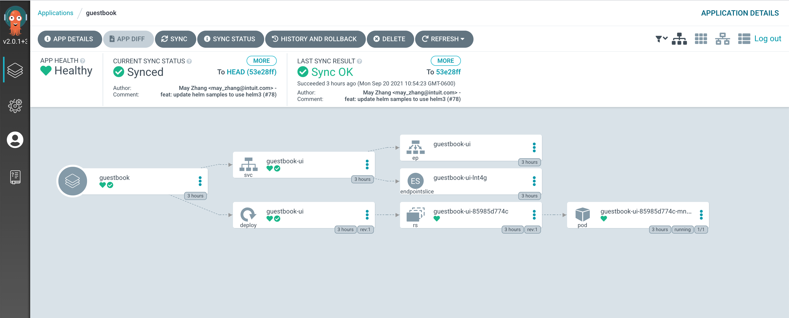
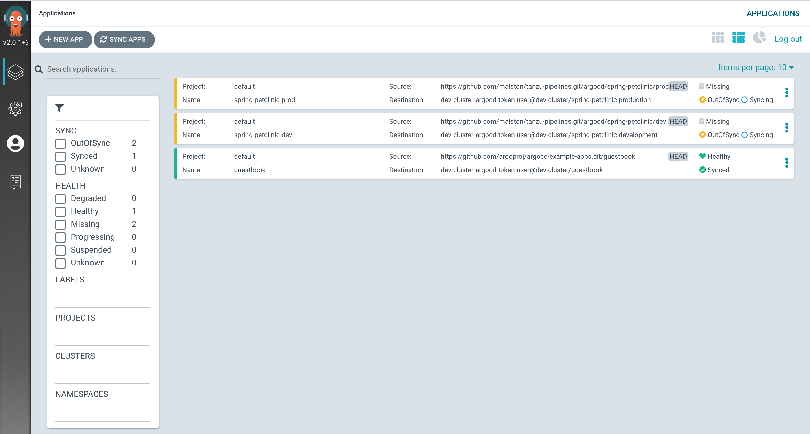
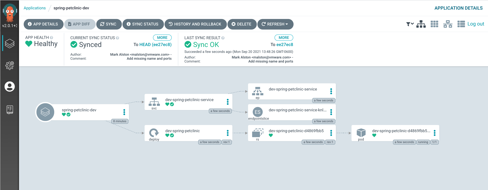
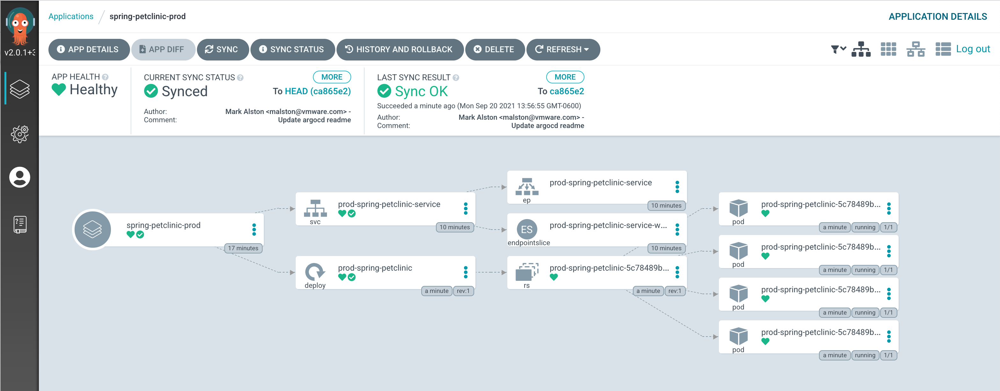
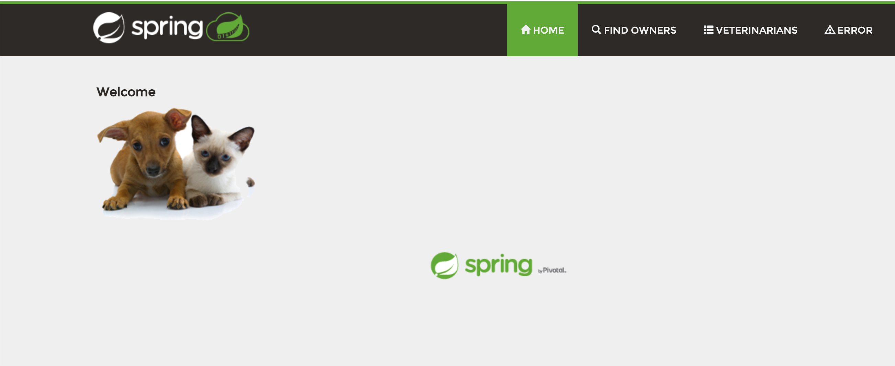

# ArgoCD and Kustomize

In this lab, we will install ArgoCD in the Shared Services Cluster

Also (optionally) we will use ArgoCD to deploy and synchronize two different configurations for the same Application using [Kustomize](https://kustomize.io/) overlays. ArgoCD will deploy and continuously reconcile our intended state of the application as represented by the [Kustomize configuration](https://kubectl.docs.kubernetes.io/guides/introduction/kustomize/) and Kubernetes manifests stored in our Github repo with the Kubernetes API Server.

## Set configuration parameters

The scripts to prepare the YAML to deploy [argocd](https://argoproj.github.io/argo-cd/getting_started) depend on a parameters to be set.  Ensure the following are set in `params.yaml` in the `local-config` directory:

```yaml
argocd:
  server-fqdn: argocd.tkg.markalston.net
  password: REDACTED
```

## Prepare Manifests and Install ArgoCD

ArgoCD installation will be installed using Helm based on the [getting started guide](https://argoproj.github.io/argo-cd/getting_started/). Manifests will be output into `generated/$CLUSTER_NAME/argocd/` in case you want to inspect.

```sh
./scripts/generate-and-apply-argocd-yaml.sh
```

## Validation

1. All ArgoCD pods are in a running state:

    ```sh
    kubectl get po -n argocd -o wide
    ```

1. Access the ArgoCD UI

    ```sh
    open https://$(yq e .argocd.server-fqdn $PARAMS_YAML)
    ```

## Install ArgoCD CLI

On a Linux or MAC Machine with network access to Kubernetes clusters,  download the latest [ArgoCD CLI](https://github.com/argoproj/argo-cd/releases/latest).

```sh
# For linux, follow below.  For Max, customize where appropriate.  Also, check version.
$ wget https://github.com/argoproj/argo-cd/releases/download/v2.1.2/argocd-linux-amd64 .
$ chmod +x argocd-linux-amd64
$ mv argocd-linux-amd64 /usr/local/bin/argocd
$ argocd version
```

## Register Workload Cluster in ArgoCD Controller

This script will add your workload Kubernetes cluster to the ArgoCD Controller. First we will create a service account in the workload cluster for `argocd`.  Then setup a `kubeconfig` context for that account. It assumes that you have successfully installed the ArgoCD CLI [above](README.md#install-argocd-cli).

```sh
./scripts/register-cluster-argocd.sh
```

## Test ArgoCD Installation

Deploy ArgoCD guestbook example application

```sh
$ kubectl create ns guestbook
$ argocd app create guestbook \
  --repo https://github.com/argoproj/argocd-example-apps.git \
  --path guestbook \
  --dest-server `kubectl config view -o jsonpath="{.clusters[?(@.name=='$(yq e .workload-cluster.name $PARAMS_YAML)')].cluster.server}"` \
  --dest-namespace guestbook \
  --sync-policy automated

application 'guestbook' created
```

View the application

```sh
$ argocd app list
  NAME       CLUSTER                      NAMESPACE  PROJECT  STATUS  HEALTH   SYNCPOLICY  CONDITIONS  REPO                                                 PATH       TARGET
  guestbook  https://192.168.40.107:6443  guestbook  default  Synced  Healthy  <none>      <none>      https://github.com/argoproj/argocd-example-apps.git  guestbook
```

Change ArgoCD guestbook example application Service type to `LoadBalancer`

```sh
$ kubectl -n guestbook patch svc guestbook-ui -p '{"spec": {"type": "LoadBalancer"}}'
service/guestbook-ui patched
```

Test access to the ArgoCD Web UI

```sh
$ echo $(yq e .argocd.server-fqdn $PARAMS_YAML)
```

1. In Chrome, navigate to the UI on address above
1. Login with
    1. `admin` and the password you set earlier.
1. Click on the guestbook app you created from the argocd CLI and investigate it.


## Demonstrate Continuous Deployment

In this example we will use ArgoCD CLI to deploy two different configurations for the same Application using the Kustomize overlays.

Create two different namespaces for the two different configurations of our application. this could easily be two different clusters as well.

```sh
$ kubectl create ns spring-petclinic-production
$ kubectl create ns spring-petclinic-development
```

Deploy the Development version of the Spring PetClinic Application. This version shares the base configuration from the `argocd/base` folder but overrides the following configuration values:

- 2 replicas in the deployment
- Service Type of `ClusterIP` instead of `LoadBalancer` as

we will be running E2E tests against the application via another Pod deployed in the same cluster so we don't need to waste a VIP and Service type `LoadBalancer`.

- Deployed to the "spring-petclinic-development" Namespace in our Kubernetes cluster.

```sh
$ argocd app create spring-petclinic-dev \
  --repo https://github.com/malston/tanzu-pipelines.git \
  --path argocd/spring-petclinic/dev \
  --dest-server `kubectl config view -o jsonpath="{.clusters[?(@.name=='$(yq e .workload-cluster.name $PARAMS_YAML)')].cluster.server}"` \
  --dest-namespace spring-petclinic-development \
  --sync-policy automated

application 'spring-petclinic-dev' created
```

Deploy the Production version of the Spring PetClinic Application. This version shares the base configuration from the `argocd/base` folder but overrides the following configuration values:

- 4 replicas in the deployment
- Service Type of `LoadBalancer` to expose the application outside the Kubernetes cluster.
- Deployed to the "spring-petclinic-production" Namespace in our Kubernetes cluster.

```sh
$ argocd app create spring-petclinic-prod \
  --repo https://github.com/malston/tanzu-pipelines.git \
  --path argocd/spring-petclinic/production \
  --dest-server `kubectl config view -o jsonpath="{.clusters[?(@.name=='$(yq e .workload-cluster.name $PARAMS_YAML)')].cluster.server}"` \
  --dest-namespace spring-petclinic-production \
  --sync-policy automated

application 'spring-petclinic-prod' created
```

List the applications to see the current status using the ArgoCD Cli.

```sh
$ argocd app list

NAME              CLUSTER                      NAMESPACE    PROJECT  STATUS  HEALTH       SYNCPOLICY  CONDITIONS  REPO                                                      PATH               TARGET
spring-petclinic-dev   https://192.168.40.107:6443  development  default  Synced  Progressing  Auto        <none>      https://github.com/malston/tanzu-pipelines.git  argocd/dev         argocd-integration-exercise
spring-petclinic-prod  https://192.168.40.107:6443  production   default  Synced  Progressing  Auto        <none>      https://github.com/malston/tanzu-pipelines.git  argocd/production  argocd-integration-exercise
guestbook         https://192.168.40.107:6443  default      default  Synced  Healthy      Auto        <none>      https://github.com/argoproj/argocd-example-apps.git       guestbook
```

Look at the ArgoCD applications in the ArgoCD UI.


Get details on the ArgoCD Spring PetClinic Development application in the ArgoCD UI.


Get details on the ArgoCD Spring PetClinic Production application in the ArgoCD UI.


## Access the applications

- Development using a port-forward connection

```sh
kubectl port-forward deployment/dev-spring-petclinic 8080 -n spring-petclinic-development &
```

- Production using the Load Balancer IP

```sh
open http://$(kubectl get services prod-spring-petclinic-service -n spring-petclinic-production -o jsonpath='{.status.loadBalancer.ingress[0].ip}')
```


